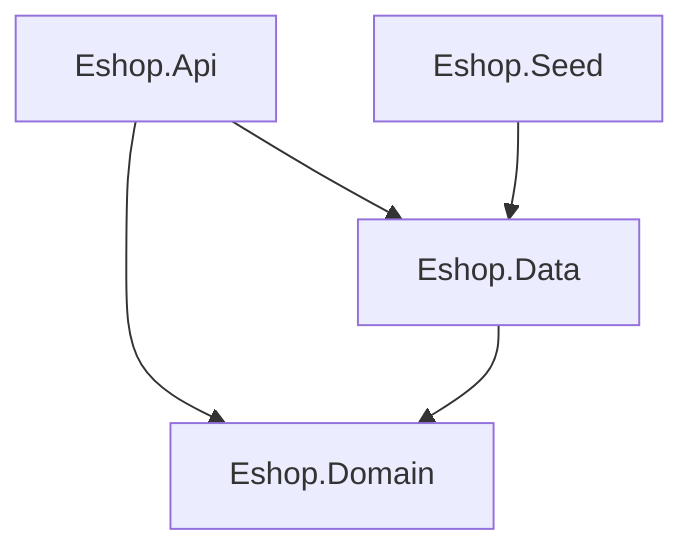

# eshop.backend-netcore
### A backend restapi created by .Net Core Minimal API
+ Three Tier Architecture
  + Eshop.Api (Startup Project)
  + Eshop.Data
  + Eshop.Domain
+ Repository/Unit of Work Design Pattern
+ EntityFrameworkCore
+ Connect to (LocalDb)\MSSqlLocalDB
+ Eshop.Seed: Provides mock data for easier testing.
+ JWT
+ Roles and Permissions (Only users with the "Admin" role can use the admin function.)


## Seed Data
The **Eshop.Seed** project is a Console application designed to streamline the process of initializing and populating the database for the Eshop application. When executed, this project automatically creates necessary tables if they do not already exist in the database. It then performs a cleanup of any old data and proceeds to insert seed data, ensuring a fresh and consistent starting point for testing and development.

By running the **Eshop.Seed** project, developers can effortlessly set up the database with the required schema and pre-defined seed data, facilitating a smooth testing environment and efficient application development.

## Database First
Packages:
 - Eshop.Api
    > Microsoft.EntityFrameworkCore.SqlServer
   
  - Eshop.Data
    > Microsoft.EntityFrameworkCore

## Code First 
Packages (Based on **Database First**): 
  
- Eshop.Api
    > Microsoft.EntityFrameworkCore.Design
- Eshop.Data
    > Microsoft.EntityFrameworkCore.Relational
    > Microsoft.EntityFrameworkCore.SqlServer

At **Eshop.Data** project:
- Using PM (Package Manager Console):
  ```
  PM> Add-Migration Init
  PM> Update-Database
  ```
- Using CLI
  > Install CLI EF Core tools
  ```
  dotnet tool install --global dotnet-ef
  ```
  ```
  dotnet ef migrations add InitialCreate --startup-project ../Eshop.Api
  dotnet ef database update --startup-project ../Eshop.Api
  ```
